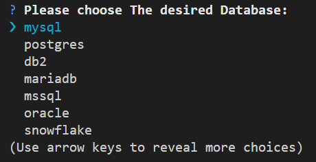
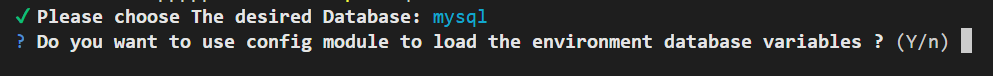
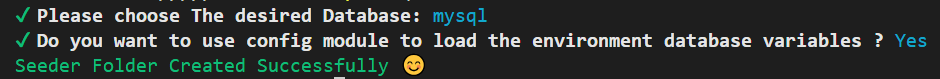
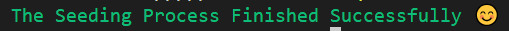

# Seqseed


## Overview

A package that eases using database seeding in an application that has Nestjs framework and Sequelize ORM.

## Table of Contents

- [Seqseed](#seqseed)
  - [Overview](#overview)
  - [Table of Contents](#table-of-contents)
  - [Installation](#installation)
  - [Usage](#usage)
  - [Documentation](#documentation)
  - [Benefits](#benefits)
  - [Contributing](#contributing)
  - [Contact](#contact)
  - [License](#license)

## Installation

To install the package in your development environment, run the following command:

  ```sh
    npm install --save-dev seqseed
  ```

Or you can install the package globally in your environment, run the following command:

  ```sh
    npm install -g seqseed
  ```

## Usage

First you have to run this command :

```sh
    npx seqseed init
  ```

  Or if you installed the package globally, you have to run this command:

  ```sh
    seqseed init
  ```

This command will ask you for some information and will create a folder that will contain the code files. for more details you can see the [Documentation](#documentation) below.

After that, you should define your database environment variables in your .env file to connect to your database. then you can write your business logic function in the seeder service class file and call this function in the seeder file.

Finally, to run the code, you should run this command:

```sh
    npx seqseed run
  ```

(Or if you installed the package globally, you have to run this command):

```sh
    seqseed run
  ```

## Documentation

Once you installed the package, you should run this command:

```sh
    npx seqseed init
  ```

after you run this command, a list of options will be shown and here a snapshot for this list:



Use the arrow keys to choose your desired database

after that, a question ask you if you want to use the config module and here a snapshot for this question:



if you enter the letter 'y', the module file will use the config service to load the environtment variables and the code will be like this:

``` typescript
SequelizeModule.forRootAsync({
      imports: [ConfigModule],
      useFactory: async (configSerivce: ConfigService) => ({
        dialect: 'mysql',
        host: configSerivce.get('DATABASE_HOST'),
        port: configSerivce.get('DATABASE_PORT'),
        username: configSerivce.get('DATABASE_USERNAME'),
        password: configSerivce.get('DATABASE_PASSWORD'),
        database: configSerivce.get('DATABASE_NAME'),
        autoLoadModels: true,
      }),
      inject: [ConfigService],
    }),
```

and if you enter the letter 'n', the module file will use process.env to load the environtment variables and the code will be like this:

``` typescript
SequelizeModule.forRoot({
      dialect: 'mysql',
      host: process.env.DATABASE_HOST,
      port: +process.env.DATABASE_PORT,
      username: process.env.DATABASE_USERNAME,
      password: process.env.DATABASE_PASSWORD,
      database: process.env.DATABASE_NAME,
      autoLoadModels: true,
    }),
```

Both of these two ways will do the their job. It's just about Your preference.

if everything goes right, then your terminal should be like this:



if you check your src folder, you will see that it has a folder called 'database-seeder'.This folder will have 3 files: seeder.ts, seeder.module.ts and seeder.service.ts

```plaintext
src/
├── database-seeder/
│   ├── seeder.ts
│   ├── seeder.module.ts
│   ├── seeder.service.ts
├── app.module.ts
├── main.ts
└── your folders
```

The seeder.ts file will have this code:

```typescript
import { NestFactory } from '@nestjs/core';
import { SeederModule } from './seeder.module';
import { SeederService } from './seeder.service';

async function bootstrap() {
  const app = await NestFactory.createApplicationContext(SeederModule);
  const seederService = app.get(SeederService);

  seederService.createAdminUser();

  await app.close();
}
bootstrap();

```

The seeder.module.ts file will have this code:

```typescript
import { Module } from '@nestjs/common';
import { SequelizeModule } from '@nestjs/sequelize';
import { ConfigModule, ConfigService } from '@nestjs/config';
import { SeederService } from './seeder.service';

@Module({
  imports: [
    SequelizeModule.forRootAsync({
      imports: [ConfigModule],
      useFactory: async (configSerivce: ConfigService) => ({
        dialect: 'mysql',
        host: configSerivce.get('DATABASE_HOST'),
        port: configSerivce.get('DATABASE_PORT'),
        username: configSerivce.get('DATABASE_USERNAME'),
        password: configSerivce.get('DATABASE_PASSWORD'),
        database: configSerivce.get('DATABASE_NAME'),
        autoLoadModels: true,
      }),
      inject: [ConfigService],
    }),
    ConfigModule.forRoot(),
  ],
  providers: [SeederService],
})
export class SeederModule {}

```

**Note:** if you answer the question that was discussed above with no, the SequelizeModule.forRootAsync() function will be changed to SequelizeModule.forRoot() function and will use the process.env instead of configService.get() function.

The seeder.service.ts file will have this code:

```typescript
import { Injectable } from '@nestjs/common';
import { ConfigService } from '@nestjs/config';
import { Sequelize } from 'sequelize-typescript';
import { QueryInterface } from 'sequelize';

@Injectable()
export class SeederService {
  private queryInterface: QueryInterface;

  constructor(
    private configService: ConfigService,
    private sequelize: Sequelize,
  ) {
    this.queryInterface = sequelize.getQueryInterface();
  }

  // example to seed the database with an admin user
  async createAdminUser() {
    await this.queryInterface.bulkInsert('Users', [
      {
        email: this.configService.get('ADMIN_EMAIL'),
        password: this.configService.get('ADMIN_PASSWORD'),
        role: 'admin',
      },
    ]);
  }
}

```

Then you should set the environment variables in your .env file and write your own function that contains the business logic and call the function in the seeder.ts file.

**Note:** you can easily use the @faker-js/faker package with this package and here an example:

```typescript
import { Injectable } from '@nestjs/common';
import { ConfigService } from '@nestjs/config';
import { Sequelize } from 'sequelize-typescript';
import { QueryInterface } from 'sequelize';
import { faker } from '@faker-js/faker';

@Injectable()
export class SeederService {
  private queryInterface: QueryInterface;
  constructor(
    private configService: ConfigService,
    private sequelize: Sequelize,
  ) {
    this.queryInterface = sequelize.getQueryInterface();
  }

  async addFakeUsers() {
    await this.queryInterface.bulkInsert('Users', this.generateFakeUsers(3));
  }

  private generateFakeUsers(numUsers: number) {
    let users = [];
    for (let i = 0; i < numUsers; i++) {
      users.push({
        first_name: faker.person.firstName(),
        last_name: faker.person.lastName(),
        age: faker.number.int({ max: 100 }),
        email: faker.internet.email(),
        password: faker.internet.password({ length: 10 }),
      });
    }
    return users;
  }
}

```

To run the code just simply run this command in your terminal:

```sh
    npx seqseed run
```

and if everything works fine, this message will appear in your terminal:



**Note:** Make sure that your database server is running and you already installed Nestjs, sequelize and the driver for your database of choice for example: install mysql2 if you will choose Mysql.

**Warning:** if you put the 'database-seeder' folder in another folder the package will work fine, but if you put the folder in a level below than that, the package will throw error. In this case, you have to run your the seeder.ts file by yourself.

Example for illustration:

```plaintext
src/
├── helpers/
│   └── database-seeder/
│        ├── seeder.ts
│        ├── seeder.module.ts
│        └── seeder.service.ts
├── app.module.ts
└── main.ts
```

This Will work fine ✅✨

```plaintext
src/
├── helpers/
│   └── database/
│        └── database-seeder/
│             ├── seeder.ts
│             ├── seeder.module.ts
│             └── seeder.service.ts
├── app.module.ts
└── main.ts
```

This Will Throw Error ❌ and you have to run the seeder.ts file manually

## Benefits

**Why do i use this package instead of sequelize-cli ?**

- It is more lightweight than sequelize-cli
- Easy to use
- Supports typescript
- Keep the nestjs structure clean and maintainable

## Contributing

Contributions are welcome! If you'd like to contribute, please follow these steps:

Fork the repository.

- Create a new branch.

- Commit your changes.

- Push to the branch.

- Open a pull request.

## Contact

If you have any questions, feel free to reach out:

- Name: Mohamed Saied Elabayoumi

- Email: mohamedalbayoumi822Gmail.com

- GitHub: <https://github.com/Mohamedelbayoumi>

## License

This project is licensed under the MIT License - see the LICENSE file for details.
